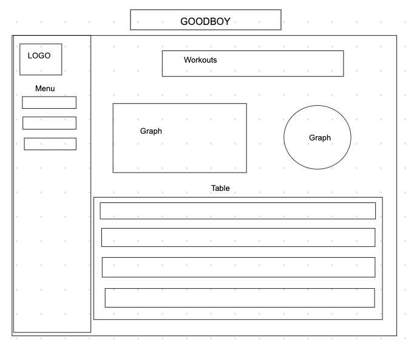

# GoodBoy

## About

GoodBoy is an app that will help you keep track of your dogs exercise. Will provide a log of workouts as well as charts to make it easy to track. 

## People that would use app

Dog lovers who want to track their pups exercise.

## Technologies used

- HTML
- CSS
- JavaScript
- Ruby on Rails
- Materialize
- Chart.js

## Future updates

- Create user authentication to log each of your dogs separtely or combine them into one profile
- Add a chart that shows their workouts for the week/month
- Create goals for exercise minutes per day with notifications 

## Wireframe

